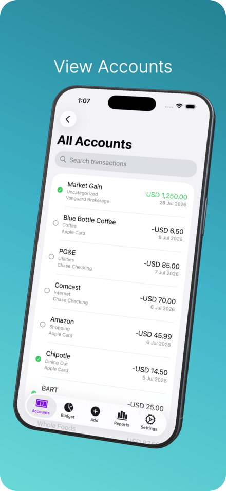
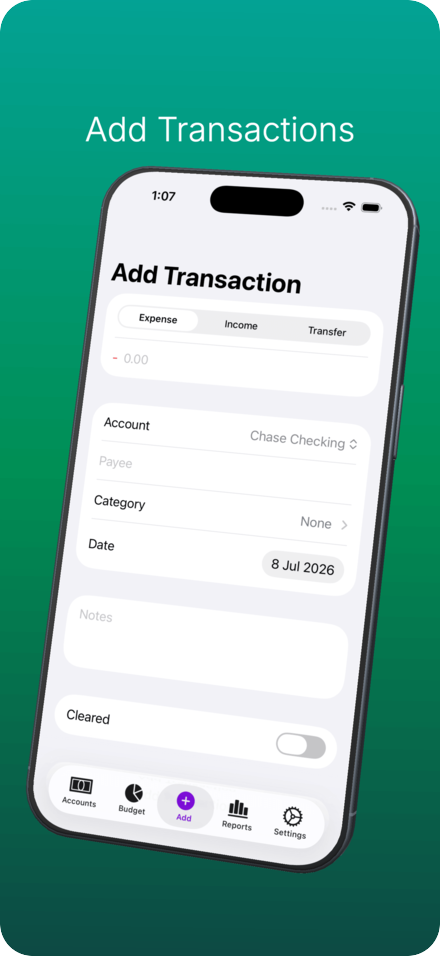
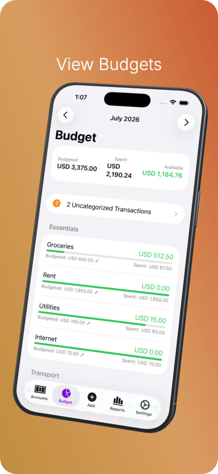
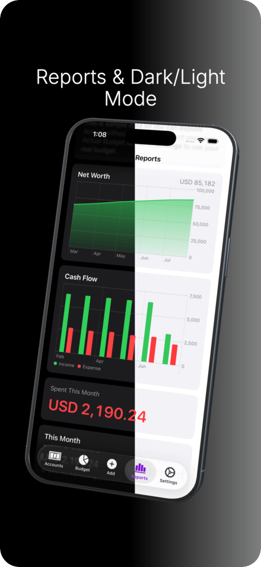

<div align="center">


# Actuali

**A native iOS companion app for [Actual Budget](https://actualbudget.org/).**

Budget, log transactions, and check balances from your iPhone or iPad — offline, on your own server.

[](https://apps.apple.com/app/actuali/id6764063765)
[](https://testflight.apple.com/join/NsYntuXB)
[](https://discord.gg/UeAYv9Zu4)
[](https://actuali.mfazz.com)
[](LICENSE)

</div>

## Overview

Actuali talks directly to your self-hosted Actual server using the same CRDT sync protocol as Actual's own clients. Every budget lives locally in SQLite, so the app works fully offline and merges cleanly with edits made on desktop or web. Your rules run on transactions you log from the phone, your reports dashboard renders with real data, and Siri/Shortcuts can log a purchase without you opening the app.

There's no cloud in the middle: no accounts, no analytics, no third-party SDKs. The app only ever talks to the server you point it at. A built-in demo budget lets you try everything with sample data before connecting anything.

This is an unofficial community project. It is not affiliated with or endorsed by the Actual Budget team.

## Screenshots

<!-- Explicit widths so all four render at the same size regardless of how wide
     the surrounding column is. They wrap on narrow screens; that's fine. -->
<div align="center">
  
  
  
  
</div>

## Features

**Accounts & transactions**

- Net worth and balances grouped by on-budget and off-budget, plus a combined All Accounts view; create new accounts from the app
- Browse your full history or a single account, paginated and backed by database-side search — by payee, category, notes, or amount
- Add expenses, deposits, and transfers; swipe to edit or delete; quick math keys (`+ − × ÷`) right on the amount keypad
- Splits: create, edit, split and unsplit existing transactions, with per-line payees and notes and a running remainder you can fill with one tap
- Reconcile accounts with a cleared balance, tappable cleared dots, and an option to hide cleared rows
- Notes on accounts, categories, and transactions, with clickable URLs

**Budgeting**

- Category-by-category budgeted vs. spent with progress bars, month-to-month carryover, and in-app editing of budgeted amounts
- Move money between categories and cover overspending
- Two layouts — a clean card look or a compact monthly table — plus group header totals, a pinned summary bar, expand/collapse all, and an option to hide categories with nothing left to spend
- Overspent categories surface as a tab badge that opens the affected list; an uncategorized-transactions view catches the rest
- Envelope (`zero_budgets`) and tracking (`reflect_budgets`) budgets are both supported

**Reports**

- Renders the dashboards you configured in the Actual webapp, with a switcher when you have more than one
- Net Worth, Cash Flow, Spending, Summary, age-of-money, formula, and custom-report widgets with real data

**Automation**

- Siri & Shortcuts: log a transaction, open a prefilled add-transaction form, or ask for an account or category balance — see the [Siri & Shortcuts guide](https://actuali.mfazz.com/guides/shortcuts)
- Background logging pushes straight to the server without opening the app; if it ever fails, tapping the notification opens a prefilled form so nothing is lost
- Import Apple Card, Apple Cash, and Apple Savings transactions from Wallet via the FinanceKit picker, mapped to the accounts you choose
- Log purchases as you make them with the [Apple Wallet](https://actuali.mfazz.com/guides/wallet-automation) and [SMS](https://actuali.mfazz.com/guides/sms-automation) automation guides
- Scheduled transactions post automatically on app open and after any successful sync, with the schedule's own category
- Background refresh keeps data fresh and notifies you about newly synced transactions
- Your Actual Budget rules run on everything logged from the app and from Shortcuts, just like on desktop

**Smart payees**

- Autocomplete from existing payees, category auto-fill from payee history, nearby payee suggestions based on where you've logged before, and automatic cleanup of Apple Pay-style merchant strings
- Location recording is opt-in per save, toggleable in Settings, and recorded coordinates are viewable and clearable from a Payee Locations screen

**Setup, sync & privacy**

- Sign in with a password or **OpenID Connect / OAuth** — the app detects which methods your server offers — plus custom HTTP headers for servers behind a proxy
- End-to-end encrypted budget files supported
- Offline-first: local SQLite with automatic CRDT sync, pull-to-refresh, and a syncing banner on first download
- All Actual currencies, with symbol-only and no-symbol display options
- Native on iPhone and iPad, **light & dark mode**, hide balances for shoulder-surfing safety, and settings for your start page and default account
- Demo budget with realistic sample data, sandboxed from real budgets — no server required
- No analytics, no third-party tracking

## Requirements

- A self-hosted [Actual Budget server](https://actualbudget.org/docs/install/) you can reach from your phone
- iPhone or iPad running iOS/iPadOS 18.0 or later

## Install

- **App Store** — [download Actuali](https://apps.apple.com/app/actuali/id6764063765)
- **TestFlight** — [join the beta](https://testflight.apple.com/join/NsYntuXB) for early access to new builds
- **Discord** — [join the community](https://discord.gg/UeAYv9Zu4) for help, feature ideas, and release chatter
- **Changelog** — [what's new](https://actuali.mfazz.com/changelog)

## Building from source

You'll need Xcode with the iOS 26 SDK. Dependencies (GRDB.swift, SwiftProtobuf, ZIPFoundation) are managed by Xcode's Swift Package Manager and resolve on first build.

```bash
# Open in Xcode
open Actuali/Actuali.xcodeproj

# Or build from the command line
xcodebuild -project Actuali/Actuali.xcodeproj -scheme Actuali -sdk iphonesimulator build

# Regenerate protobuf code (only if sync.proto changes)
protoc --swift_out=Actuali/Actuali/Generated/ Actuali/Actuali/Resources/sync.proto
```

Build numbers are stamped automatically at build time from the git commit count, so pull requests never need to touch them.

## Architecture

```
UI (SwiftUI Views)
    ↓
BudgetStore (@MainActor, ObservableObject)
    ↓
Services Layer
├── BudgetDatabase (GRDB) → SQLite
├── SyncClient (actor) → CRDT sync engine
└── ActualServerClient (actor) → Network
```

The sync engine (`Actuali/Actuali/Services/Sync/`) implements Actual's CRDT protocol: a hybrid logical clock for causality ordering, a Merkle tree for efficient diffing, field-level CRDT messages, and protobuf encoding. Writes go to local SQLite first, generate CRDT messages, and sync to the server with a short debounce; reads are plain SQLite queries. Alongside it live Swift ports of Actual's rules engine, schedule recurrence, and report widget logic.

## Relationship to Actual Budget

Actuali is a companion client, not a fork or replacement. It requires an Actual server and stores nothing anywhere else. The sync engine is a Swift port of Actual's CRDT implementation (`packages/crdt` and `packages/loot-core` in the [upstream repo](https://github.com/actualbudget/actual)), which is MIT-licensed — see [LICENSE](LICENSE) for the attribution notice. For development, the upstream repo can be cloned into `actual/` (gitignored) as a reference implementation.

## Contributing

See [CONTRIBUTING.md](CONTRIBUTING.md). Bug reports and feature requests are welcome as [GitHub issues](https://github.com/MattFaz/actuali/issues), or come talk it through on [Discord](https://discord.gg/UeAYv9Zu4).

## Credits

The app icon was designed and contributed by [u/bdownz](https://www.reddit.com/user/bdownz/). Masters live in [`assets/icons/`](assets/icons/).

## License

MIT — see [LICENSE](LICENSE). Portions ported from Actual Budget (MIT, copyright James Long).
